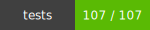
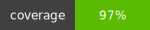

   <h3 style="padding:none">Unit test coverage report for @web/tesla-lang@0.1.47</h3>

   

   
   

   

       

       <ul style="list-style-type: none;padding: 0;">
           <li style="padding-right: 16px; font-weight: bold">Statements:  98.29% </li>
           <li style="padding-right: 16px; font-weight: bold">Functions: 100%</li>
           <li style="padding-right: 16px; font-weight: bold">Lines: 98.29%</li>
           <li style="padding-right: 16px; font-weight: bold">Branches: 92.05%</li>
       </ul>
   

   

     To view more a detailed coverage report for this module, run:
     <pre>$ npm run coverage</pre>
     Coverage files will be written to the /coverage directory under your project root. Detailed coverage reports are not checked in.
   

