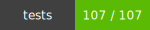
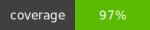

## tesla-lang
----

 

### Provides localized formatting for:

  * Currency & Number formatting for all Tesla markets
  * Date & Time (using moment.js)


### Installation

    $ npm install @web/tesla-lang --save

### Usage

This works as a standard commonjs (node) module, but can also be used in other environments
For more detailed usage notes see comments

#### Language Formatting Methods

```
// -- Set the default locale to be used for all calls following setLocale
lang.setLocale("en_US")
lang.formatCurrency(1234)  // returns $1,234
lang.formatNumber(1234.00) // returns 1,234.00

lang.setLocale("de_DE")
lang.formatCurrency(1234) // returns
lang.formatNumber(1234.00) // returns 1.234,00 €


// -- Check if state / province / territory is supported by current locale
lang.setLocale("en_US")
lang.isSupportedRegion("CA")

// -- Get locale format object for locale set via setLocale
lang.setLocale("en_US")
lang.getLocaleFormat("en_US")
// returns
{
    "currency": "USD",
    "symbol": "$",
    "decimal": ".",
    "thousand": ",",
    "format": "%s%v"
}

// -- converts locale formatted numbers / currency to float
lang.setLocale("en_US")
lang.toFloat("$1,234") // 1234
lang.toFloat("$1,234.25") // 1234.25

lang.setLocale("de_DE")
lang.toFloat("1,234 €") // 1234
lang.toFloat("1.234,25 €") // 1234.25

```

#### Strings

**lang.get(key, vars, strings, opts)**

```
const strings = {
    "foo": "bar,
    "qux": "qax",
    "quux": {
        "qaax": "Hello"
    },
    "rebates": "{AMOUNT} in rebates"
}

lang.setStrings(strings);
lang.get('foo') // returns 'bar'
lang.get('quux.qaax') // returns 'Hello'
lang.get('rebates', {AMOUNT: lang.formatCurrency(1234)}) // returns '$1,234 in rebates'

```

**opts** param:

|prop|type|description|
|---|---|---|
| plural | true/false | when true, plural code kicks in |
| count | Integer | number to base plural logic on |
| gt | Integer | when count > gt, then use pluralForms.gt |
| lt | Integer | when count < lt, then use pluralForms.lt |

In translations json:

the ***default*** key is used of none of the plural conditions match

**allowed pluralForms**

|key| used when|
|---|---|
|zero| opts.count === 0|
|single| opts.count === 1|
|multiple| opts.count > 1|
|gt| opts.count > opts.gt |
|lt| opts.count < opts.lt |

**Example:**

```
const strings = {
    "myVar": {
       "default": "New inventory vehicles available"
        "pluralForms": {
           "zero": "No inventory vehicles available at this time",
           "single": "One inventory vehicle available",
           "gt": "Many inventory vehicles available",
           "lt": "Few inventory vehicles available"
       }
    }
}

// pass plural:true
// and count --- number of things you are counting
lang.get("myVar",null, strings, {
    plural: true,
    count: 1
}) // returns (myVar.pluralForms.single) "One inventory vehicle available"

lang.get("myVar",null, strings, {
    plural: true,
    count: 2
}) // returns (myVar.default) "New inventory vehicles available"

lang.get("myVar",null, strings, {
    plural: true,
    count: 0
}) // returns (myVar.zero) "No inventory vehicles available at this time"

lang.get("myVar",null, strings, {
    plural: true,
    count: 27,
    gt: 25
}) // returns (myVar.gt) "Many inventory vehicles available"

```

#### Date/Time/Number
###### Module Usage

    var lang = require("@web/tesla-lang");
    var moment = lang.moment;

    /**
    * Format currency
    * @param num
    * @param locale (optional -- defaults to whatever was set in setLocale)
    * @param opts (optional)
    */
    lang.formatCurrency(num, locale, opts);

    /**
    * Format numbers
    * @param num
    * @param precision (number of decimal places to format number to)
    * @param locale (optional)
    */
    lang.formatNumber(num, precision, locale);

    // dates
    var fmt = "YYYY-MM-DD";
    lang.formatDate(dte, fmt);  // does same same as moment(dte).format(fmt), but implemented as a place to inject default formats
    // -- or --
    moment(dte).format(fmt);

    // You can also set locale first so you don't have to pass it for subsequent calls
    lang.setLocale("en_US");
    lang.formatNumber(num, precision);
    lang.formatCurrency(num);

### Tests

    $ npm run test

### Notes

  *This module brings localized number/currency/date formatting capabilities previously found in **localize.js** from teslamotors.com*


