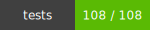
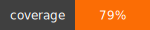

## tesla-utils
----
  

Utilities for simplifying common tasks

#### Installation
    > npm install

#### Modules
| Module       | Description                                 |
|--------------|---------------------------------------------|
| TeslaExpressLogger | Middleware for express modules that logs access and errors to log files
| TeslaOrderUtils| Utility methods for common tasks when dealing with configuration/option data
| swaggerUtils| Utility methods for common tasks when dealing with swagger API's|
| domUtils| Simple DOM methods (for use in non-jQuery projects that need simple class manipulation)|
| keyUtils| Contains constants for common keystrokes and utility methods for detecting when specific key sequence has been entered|
| formUtil| util to create hidden form on the fly and POST data to a url|
| csvToJson| Simple utility method to convert a csv file to JSON|
| DataType| data type coercion utils toBoolean |
| URL| parse querystring into params or params into querystring |

#### Documentation

######TeslaOrderUtils
| Methods | Description|
|---------|
| isRN(str) | is string a valid ReferenceNumber? |
| isVIN(str)   | is string a valid VIN? |
| diff(opts1[], opts2[])    | diffs two arrays of options |
| optionStringToArray(str) |  converts optionString to array|
| optionsArrayToOptionsString(opts[]) | convert array of options to optionsString (a.k.a. Manufacturing String)|
| optionPriceStringToArray(str) | converts optionsPriceString to array of option objects |
| getOptionsPriceDiff(opts1[], opts2[]) | Returns total price difference between two arrays of options with prices|
| replaceOption(options {string or array}, from, to) | replaces from option with to option|


Example: Get diff of two different arrays of options

    var orderUtils = require('@web/tesla-utils/common/TeslaOrderUtils');
    var diff = orderUtils.diff(['OPT1','OPT2'], ['OPT1', 'OPT3']);

    console.log(diff);

    => {
           addedOptions: ['OPT3']
           removedOptions: ['OPT2']
       }

###### swaggerUtils


| Methods | Description |
|-------| -------- |
| getModuleRoutes(module)| returns array of all routes found in module|
| addToRestServer(routes, restServerInstance)| add array or routes to restServerInstance (@see tesla-rest-sever)|


Example: Add all routes in module to rest server


     var swaggerUtils = require('@web/tesla-utils/api/swaggerUtils');
     var restRoutes = require('rest-routes-module.js');

     swaggerUtils.addToRestServer(swaggerUtils.getModuleRoutes(restRoutes), restServer)

  Note: if you don't want one of your routes actually added to the rest server,
     then add **enabled: false** to the route spec definition

    "spec": {
       enabled: false
    }

###### Tesla Logger

  Wrapper module for [Morgan](https://github.com/expressjs/morgan) and [Winston](https://github.com/winstonjs/winston)

  Usage in server.js
  
  ```
let TeslaLogger = require('@web/tesla-utils').middleware.TeslaLogger;
    logger = new TeslaLogger({
    infoLog: '/var/log/some-api-info.log',
    errorLog: '/var/log/some-api-error.log'
    debugLog: '/var/log/some-api-error.log'
});
app.use(logger.log());
```

  Note: Log files must exist and be writable

  Single Log in File
  
  ```
{
 "level":"info",
 "message":"::1 - - [24/Jun/2016:23:59:11 +0000] \"GET /geoip/v1.0.3/country/?ip=12.12.12.10 HTTP/1.1\" 304 -\n",
 "timestamp":"2016-06-24T23:59:11.039Z"}
```

####Rest
|Methods | Description |
|--------|-------------|
|isValidIP(str)| returns BOOL of whether or not an IP address is valid|
|parseParams(request)| returns query params from request|

####Running Tests

    > npm test
    > npm run quality (update coverage)

